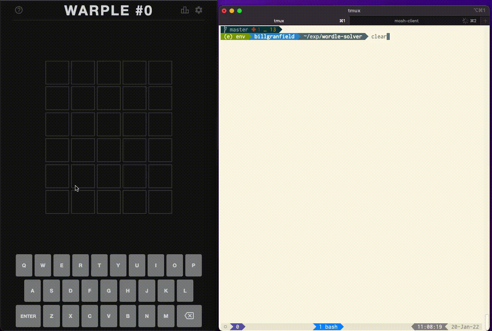

# wordle-solver

Solve wordle on the CLI.




The solver algorithm works as follows:

**1) build a prefix tree of the entire dictionary of solutions**

**2) "summarize" the clues seen so far - i.e. which letters are legal in which positions and how many times must each letter appear in the solution**

**3) choose the guess that will maximize the number of leaves removed from the dictionary tree for all possible guesses**

In pseudocode, (3) is performed as follows:
```
for every possible solution:
    for every possible guess:
        calculate and store leaves_removed(solution, guess) -- the number of leaves removed for "guess" assuming the solution is "solution"

choose the guess with the maximum leaves removed (i.e. sum(leaves_removed(*, guess))) across all possible solutions.
```

# Usage

The first guess was precomputed as `raise`, so the solver should always use `raise` as its first guess.

Afterward, enter each subsequent guess and its corresponding clues as follows:

```
python solver.py \
--guess raise --clues YYY__ \
--guess dital --clues _G_G_
```

### Clues syntax
If wordle's clue does not have a color for a particular letter (i.e. the letter is not present in the word), use `_`.
If wordle's clue is yellow, use `Y`
If wordle's clue is green, use `G`
